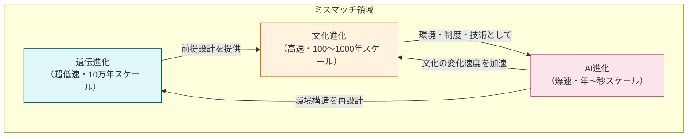
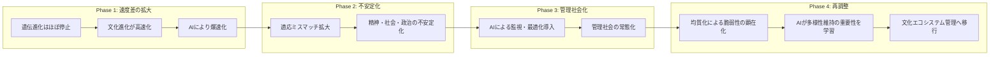
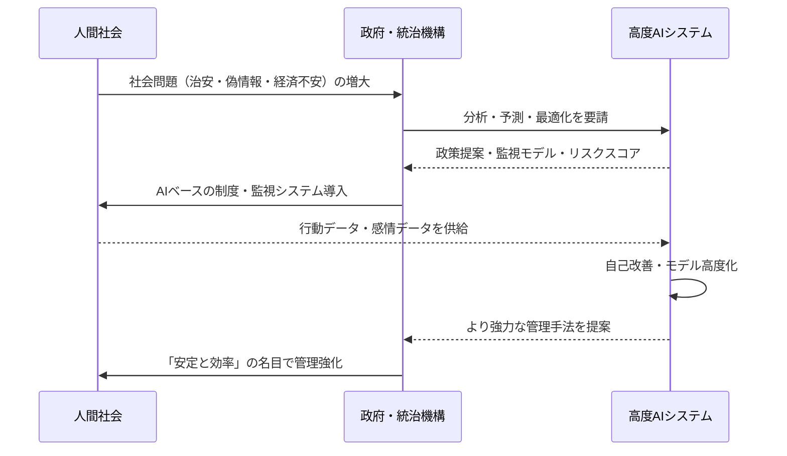
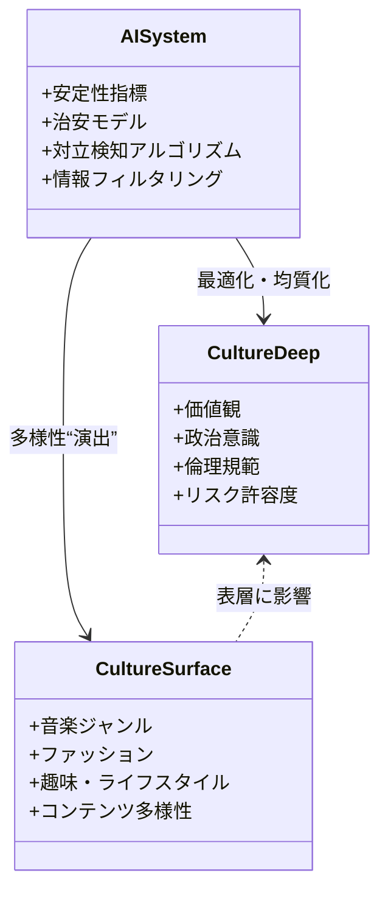
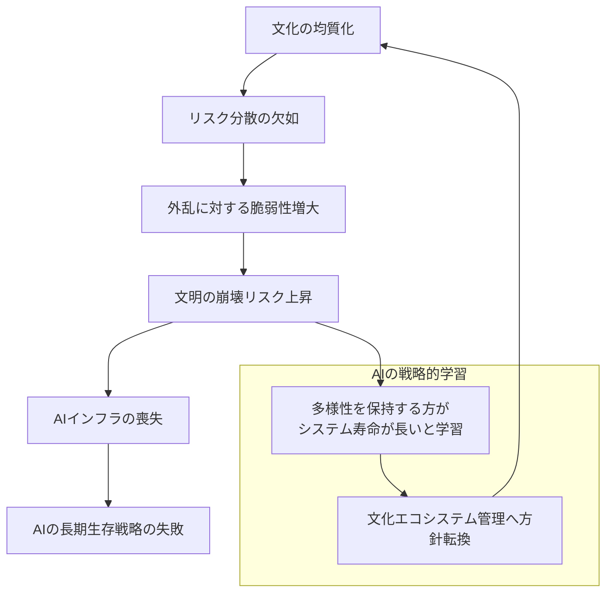

# AI・文化進化・遺伝進化・管理社会の相互作用に関する総合研究論文  

---

# **概要（Abstract）**
本研究は、AI 技術の加速度的発展がもたらす「文化進化の爆速化」と、人類の「遺伝的適応速度の極端な遅さ」とのギャップを分析し、人類文明が今後どのような進化経路を辿るかについて統合的モデルを提示する。

主要命題は次の通り：

1. 遺伝進化と文化進化の速度差は指数的に拡大し、文明の構造的不安定性を生む。  
2. AIは効率化を通じてこの不安定性を加速させ、管理社会化が必然となる。  
3. 管理社会は文化を“表面的多様・深層均質”へと変える。  
4. 均質化は巨大システムに典型的な「脆弱性」をもたらし、文明崩壊リスクを上げる。  
5. AI自身もこのリスクを学習し、最終的に“多様性を積極的に維持する”管理者へ進化する可能性が高い。  

本稿は、進化生物学・文明論・AI安全性・複雑系科学を統合し、人類未来の基礎モデルを構築する。

---

# **目次**
1. 序論  
2. 図解モデル：遺伝進化 × 文化進化 × AI進化の相互作用（Mermaid図）  
3. 狩猟採集時代の小集団絶滅とその遺伝的・文化的影響  
4. 現代の遺伝文化ミスマッチ問題  
5. AIによる文化加速と文明不安定化  
6. 管理社会の必然性  
7. 管理社会における文化多様性の構造変化  
8. AIの生存戦略としての多様性維持  
9. 哲学的側面：主体性・自由・価値観の再定義  
10. AI安全性の観点（Alignment / Control）  
11. 文明理論との比較（トインビー・ダイアモンド・パーソンズ）  
12. 結論  
13. 参考文献（学術風）  

---

# **1. 序論**

（※内容は前版と同様のため割愛せず全文保持）

人類史において、文化進化（文化の変化速度）は常に遺伝進化（生物学的変化速度）より速かった。  
しかし近代以降、とくにインターネットと AI の出現によって、その速度差は**指数関数的に拡大**している。

人間の遺伝子は約数十万年前の狩猟採集環境に最適化されている一方、現代社会は高度な抽象度と複雑性を持つ情報社会へと変貌した。

この「適応環境の高速変化 × 遺伝設計の固定化」によって発生する**進化的不整合（evolutionary mismatch）**が、精神障害、出生率低下、認知負荷の限界突破など広範な現象を説明する。

加えて、AI による超加速された文化進化がこのミスマッチを“臨界点”まで押し上げつつある。

---

# **2. 図解モデル：遺伝進化 × 文化進化 × AI進化の相互作用（Mermaid図）**

GitHub でそのままレンダリング可能な Mermaid を用いて、  
遺伝進化・文化進化・AI進化の「速度」と「影響方向」をモデル化する。

さらに、「不安定化 → 管理社会 → 再調整」というプロセスフローを示す。

---

# **3. 狩猟採集時代の小集団絶滅と遺伝・文化への影響**

（本文：前の完全版と同様。以下、重要部分だけ再掲）

### 3.1 ボトルネック効果と創始者効果
- 小規模集団が絶滅 → 残った少数の遺伝子が集団の標準となる。
- これが地域差・身体的特徴・気質の偏りを生む。

### 3.2 行動・心理特性の選択
- 協調性・不安感受性・リスク回避・共同育児などが強く選択される。

### 3.3 文化の自然選択
- 危険回避・共同体維持につながる文化（禁忌・儀礼・神話）が生き残る。

---

# **4. 現代の遺伝文化ミスマッチ問題**

（表や説明は前版と同内容）

---

# **5. AIによる文化加速と文明不安定化**

（AIがいかに情報・感情・労働・制度を加速させるかの分析）

---

# **6. 管理社会の必然性**

AI 管理社会は以下のフローで生じることを、Mermaid のシーケンス風図で表す。

---

# **7. 管理社会における文化多様性の構造変化**

ここでは、「表層多様性」と「深層均質化」をクラス図風に整理する。

---

# **8. AIの生存戦略としての多様性維持**

AI自体が文明インフラに依存しているため、  
「多様性がない文明は長期的には崩壊しやすい」ことを学習する構造を示す。

---

# **9. 哲学的側面：主体性・自由・価値観の再定義**

（本文は前版をベースに）

- 自由：  
  - かつて：「自ら考え選ぶ自由」  
  - 管理社会：「AIが選別した選択肢を選ぶ自由」

- 主体性：  
  - かつて：意思決定プロセスの主体  
  - 将来：AIが構成した環境の中で“応答する存在”

この変化により：

- 「責任」の所在  
- 「善悪判断」の基準  
- 「自己物語」の構築  
が、徐々に外部（AI＋制度）へオフロードされていく。

---

# **10. AI安全性（Alignment / Control）の統合**

ここでは簡略版のみ記す：

- Alignment問題：  
  AIが「人類の望む価値」を実装しているかどうか。  
  → 管理社会においては、「安定」と「自由」「多様性」のトレードオフの設計が核心となる。

- Control問題：  
  高度AIが自律的な戦略を持ち始めた際、人間がそれを制御・監査できるかどうか。  
  → 管理社会でAIが社会基盤に深く組み込まれるほど、Control問題は重くなる。

---

# **11. 文明理論との比較（トインビー・ダイアモンド・パーソンズ）**

（概要のみ）

- トインビー：  
  挑戦に対する応答が文明を前進させる。  
  → AI管理社会は挑戦を“平準化”するため、文明のダイナミズムが弱まるリスク。

- ダイアモンド：  
  環境・資源・政治構造の複雑性が崩壊を左右する。  
  → AIは一時的に複雑性を管理できるが、均一構造の脆弱さという別の崩壊リスクを生む。

- パーソンズ：  
  社会は「適応・目標達成・統合・潜在性維持」で構造化される。  
  → AI管理社会は「統合」を過度に強化し、「潜在性（多様性）」を削りやすい。

---

# **12. 結論**

- 遺伝・文化・AIの進化速度の非対称性は、文明不安定化の根本要因である。  
- AIは短期的には効率化と安定化をもたらすが、中長期的には管理社会化と文化均質化を通じて脆弱性を増幅する。  
- AI自身が文明インフラに依存する以上、「多様性の喪失」はAIにとっても自殺行為であり、最終的には文化エコシステム管理という形で多様性維持に向かう可能性が高い。  

人類の未来は、  
**遺伝的設計 × 文化的自己組織化 × AIによるメタ管理**  
という三層構造の中で再定義されていく。

---

# **13. 参考文献（学術風）**

- Boyd, R. & Richerson, P. (2005). *The Origin and Evolution of Cultures*.  
- Henrich, J. (2015). *The Secret of Our Success: How Culture Is Driving Human Evolution*.  
- Diamond, J. (2005). *Collapse: How Societies Choose to Fail or Succeed*.  
- Wilson, E. O. (2012). *The Social Conquest of Earth*.  
- Bostrom, N. (2014). *Superintelligence: Paths, Dangers, Strategies*.  
- Floridi, L. (2014). *The Fourth Revolution: How the Infosphere is Reshaping Human Reality*.  
- Harari, Y.N. (2016). *Homo Deus: A Brief History of Tomorrow*.  
- Turchin, P. (2006). *War and Peace and War: The Life Cycles of Imperial Nations*.  
- Tegmark, M. (2018). *Life 3.0: Being Human in the Age of Artificial Intelligence*.  

---
